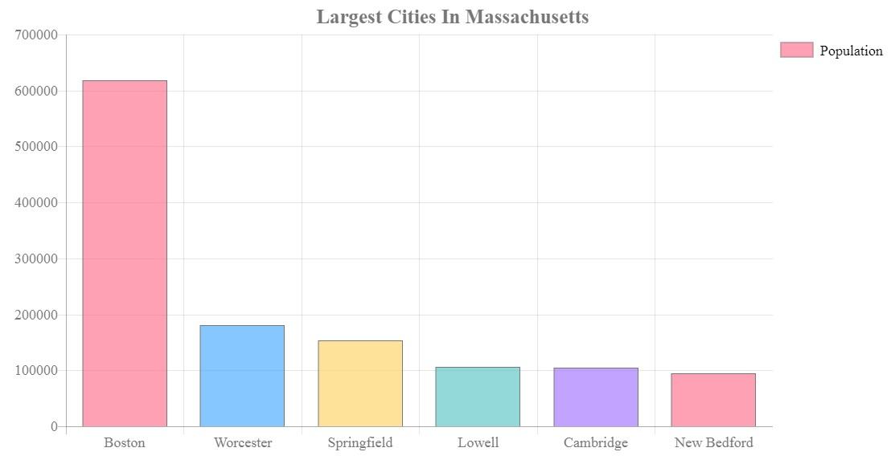

# [Getting Started With ChartJS](https://www.youtube.com/watch?v=sE08f4iuOhA)

In this tutorial, we learn how to use Chart.js which is a simple yet flexible JavaScript charting for designers and developers.

[View demo site here.](https://webdevtuts.github.io/get_started_with_chartjs/)

